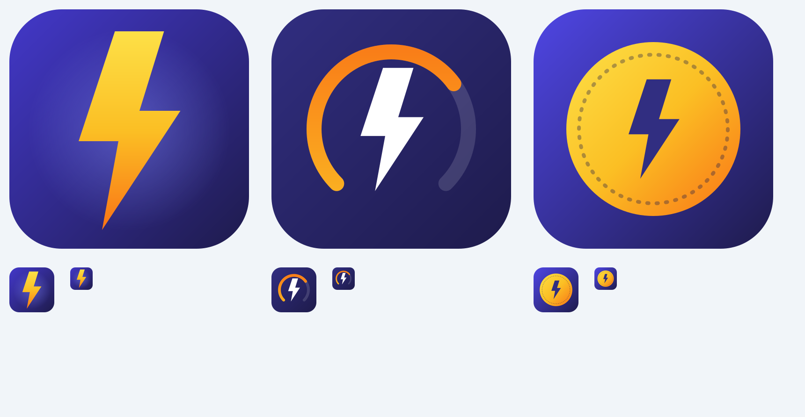

# Logo de l'application

L'ancien logo était celui du framework **Flet** (icône et splash). Il est remplacé par un logo propre au projet.

## Logo retenu : « Jauge prépayée » (option B)

Une jauge de crédit (arc orange = crédit restant) autour d'un éclair : le suivi du crédit de kWh d'un compteur
prépayé, en une image. Couleurs de la marque de l'app : indigo `#312e81 → #1e1b4b`, orange `#f97316 → #fbbf24`.

## Les deux autres pistes (prêtes à l'emploi)

| | Piste | Forces | Limites |
|---|---|---|---|
| A | `logo/A_eclair.svg` — éclair jaune-orange sur indigo | Très lisible même à 48 px | Générique (beaucoup d'apps utilisent un éclair) |
| **B** | `logo/B_jauge.svg` — jauge + éclair **(appliquée)** | Raconte « crédit prépayé » ; distinctive | Un peu plus de détails à très petite taille |
| C | `logo/C_jeton.svg` — pièce/jeton avec éclair | Évoque le jeton de recharge à 20 chiffres | Ressemble à une icône de « monnaie » |

Une piste « monogramme K » a été essayée puis abandonnée (les bras du K se chevauchaient mal avec l'éclair).

## Changer de logo

1. Copiez l'option voulue sur les fichiers `B_*.svg` (ou adaptez `docs/logo/export.cjs`) — `icon`, `foreground`, `background`, `splash`.
2. `npm i --no-save sharp && node docs/logo/export.cjs` régénère `public/icon*.png` et `public/splash*.png`.
3. `npx @capacitor/assets generate --android --assetPath public` régénère les ressources Android (la CI le refait à
   chaque build ; les fichiers générés sont aussi committés pour rester cohérents en local).

## Détails techniques

- `icon-foreground.png` est volontairement conçu **sans réduction préalable** : `@capacitor/assets` applique déjà un
  `inset` de 16,7 % dans `ic_launcher.xml` (zone de sécurité Android). Une double réduction rendait l'icône trop petite.
- Fond du splash `#1e1b4b` et spinner orange : alignés dans `capacitor.config.ts`.
- L'icône de notification (barre d'état) reste une silhouette d'éclair monochrome (`res/drawable/ic_stat_notify.xml`).
